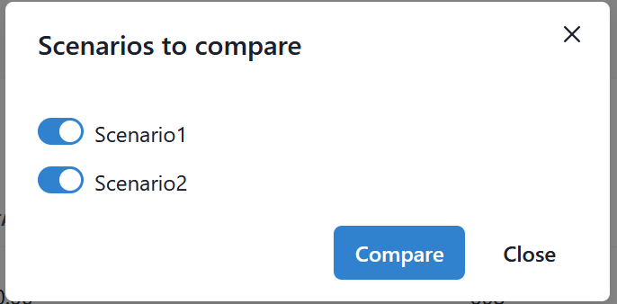
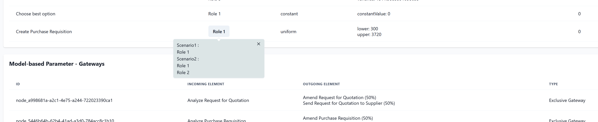
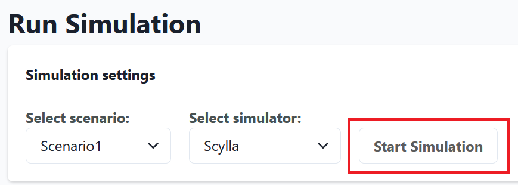

# Tutorial
This tutorial document demonstrates the usage of SimuBridge on an example. We use the [Purchasing Example](https://github.com/AutomatedProcessImprovement/Simod/tree/master/resources/event_logs) event log in the tutorial.

 ## Start the project
When you open the tool you have two possibilities to start: create a new project or import an existing project from a .json file.  

   

 In this tutorial, we start from scratch: Thus, we create an empty new project by clicking the _Start New Project_ button.

 

   

 It is possible either to create an empty simulation scenario and fill all parameters manually or to use an integrated process mining tool to automatically extract a BPMN model and the simulation parameters from an event log. 
 We will demonstrate the second option.
 Currently, the only available process mining tool is [Simod](https://github.com/AutomatedProcessImprovement/Simod).

 ## Process Mining & Simulation Scenario Creation

 To extract the simulation scenario and simulation parameters, we go to the process mining page by clicking  _Run Process Miner_ on the navigation sidebar or by clicking _Add Scenario from Process Mining_ on the _Project Overview_ Page. The miner requires an event log as an input parameter. As The user can upload the event log by clicking on the _Upload new event log_ button. Additionally, the user has to choose a process mining tool from the available options. In the moment, the only integrated process mining tool is _Simod_.

 After settings are specified, we run the process miner by clicking _Start Miner_.

 

   

SiumBridge will then confirm the successful start of the process mining run with a green pop-up at the bottom.  
Later, a similar pop-up indicates when the run terminated successfully. 
 

   

The .json and .bpmn file that are produced by Simod for a run are then listed under _Miner Output_ at the bottom of the page. These files represent BPMN process diagrams and simulation parameters mined from the event log. You can download each of them by clicking on the respective list entry. 

To import a simulation scenario from the Simod output, we select one of the .json output files, which contain simulation parameters in Simod format, and a BPMN XML file that contains the mined process model. After clicking _Convert to Scenario_, we specify the scenario name "Scenario1". 

 

   

## Scenario Overview

On the _Scenario Overview_ page, we can now see the parameters of the scenario we created. These include general scenario parameters, resource parameters, and process-model-related parameters. To access this page, we click on _Scenario Overview_ in the navigation sidebar. If we want to change the general simulation parameters or make a copy of the scenario with some modifications, we can click on _Edit_. 

 

   

 

Let us duplicate the scenario and make some changes afterward. 
After clicking _Duplicate Scenario_  Scenario1_copy is immediately created. Nevertheless, the original scenario is still shown. We can display the newly created scenario using a scenario switcher on the left sidebar. 
After selecting Scenario1_copy, now at the _Scenario Overview_ page, we can see the parameters for Scenario1_copy. 
Let us make some changes: We replace the scenario name Scenario1_copy with Scenario2 and change the starting time to 12:00  by clicking the _Edit_ button. To save, we click _Save Changes_.

 
Let us now explore the other simulation scenario parameters: Resource and process model.

 
 

## Resource Parameters

<!-- Screenshot for state after creating the data conditions -->

 Resource parameters provide an overview of resources involved in the business process and their timetables with their availabilities to work on process activities. To access resource parameters, we click  _Resource Parameters_ on the sidebar navigation panel. 

Each resource can be assigned to one or several roles. Resources are individual employees, machines, etc. that work on concrete process activity instances. Roles are a grouping mechanism to collect resources with similar capabilities and responsibilities.

 

   

We can get detailed information about a specific role or resource by clicking on it. 

 

   

 

   

The resources that belong to a role inherit the default timetable and costs of their role. However, we can customize these parameters for each resource individually. To do this, we click on the resource we want to edit, enter the new values and click _Save Changes_.

   

We can assign a resource to one or multiple roles, or leave it unassigned. To unassign a resource from a role, we uncheck the respective checkboxes under _Select Roles_. If a resource has no role, it will show up in the unassigned resource section. 

   

We can investigate the timetable of each role by clicking on the _Timetable_ tab on the top bar.

 

The tools visualizes timetables by highlighting hours of the week where the respective resources are active. We can select the timetable to display by clicking on its name. By default, Simod names timetables like the corresponding roles. 

   

Timetables are defined by a set of items, i.e., continuous time intervals. 
We can select these items by clicking on the respective highlighted time. The currently selected item is highlighted in a different color and can be edited or deleted in the right side panel. 
New items can be added by clicking on unhighlighted hours, i.e., times not currently part of the timetable.

## Process Model Parameters

To display the BPMN process diagram of the business process, we click on _Modelbased Parameters_ on the navigation sidebar. We can zoom in or zoom out the model by clicking on the "plus" or "minus" at the bottom of the screen or pressing Ctrl while scrolling. 
We can select process elements by clicking on the respective BPMN diagram element. 
This selects the element for editing and the tools display the element's parameters in the sidebar. 
Let us add one more role to the first activity. To do this, we expand the _Resources_ section, press _+_, and select the role's name. The changes are saved automatically.

   

<!--
We can represent the BPMN process diagram as XML document, or also as a table for better overview in which we can see all parameters in a table view. 
 
For getting this view, click on _View_ on the bottom left of the screen and then click _Table_. We represent the activities, gateways, and the events in three separated sections. The _Edit mode_ can be activated by clicking on it.
 
 
 
 

   

 
 
 -->

## Compare Scenarios
At the _Project Overview_ page, we can see all the scenarios that have been created. We can also duplicate and delete scenarios from this page. If we want to see how different scenarios are, we can use the _Compare Scenarios_ function.

To compare scenarios, we click on the _Compare scenarios_ button, select the scenarios we want to compare using the switches and click _Compare_.

   

The compare view initially appears like the scenario overview for the currently selected scenario. 
However, parameters that are different in the other scenarios will be highlighted as buttons. 
The parameters that are the same in all scenarios will not be highlighted. 
We can click on a highlighted parameter to see its values in the other scenarios.
For example, the role assignment we changed earlier is highlighted under_Model-based Parameters - Activities_

   

## Run Simulation

After specifying a scenario and reviewing all parameters we can simulate it in the simulation view. We go there by clicking  _Run Simulation_ on the navigation sidebar.
In this view we can specify the scenario to simulate and the simulator to use. Currently, the only integrated simulation tool is [Scylla](https://github.com/bptlab/scylla). We start the simulation by clicking on the respective button.

   

Like for the process mining view, run status is indicated with pop-ups, and console outputs as well as output files are displayed at the bottom under _Simulator Feedback_.

## Export Project 
Finally, we can download project file in json format by clicking _Download Project_ on the sidebar navigation menu. The file contains all created simulation scenarios and simulation parameters.
This allows us to share projects with other people.

If we want to resume working on the project at a later session, we do not need to export and download the project, as project data is persisted locally in the browser.  
