# Tutorial
This tutorial document demonstrates the usage of SumuBridge as an example. A video version of the tutorial is available [here](https://github.com/INSM-TUM/SimulationPortal--Main).  Comment: add link to YouTube. We use the free event log [Purchasing Example](https://github.com/AutomatedProcessImprovement/Simod/tree/master/resources/event_logs) in this tutorial.  Comment: here is link to eventlog from Simod repo. Should be smth else(more official)?

 ## Start the project
When you open the tool you have two possibilities to start: create a new project or open the project from files(e.g., existing project).  

   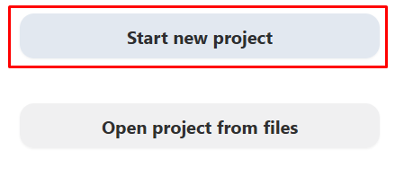

 In this use case, we start from scratch, so  create an empty new project by clicking the _Start New Project_ button.

 

   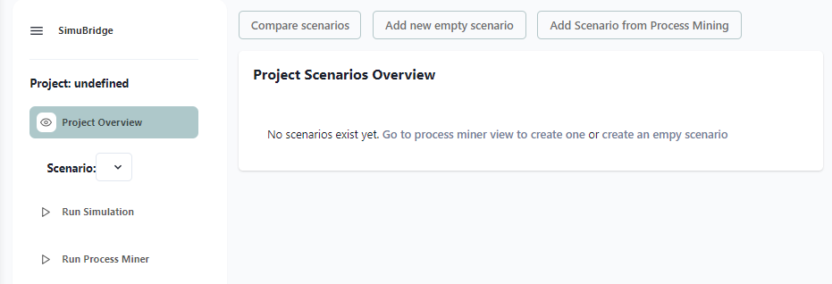

 It is possible either create an empty simulation scenario and fill all parameters manually or use an integrated process mining tool to automatically extract the simulation scenario and BPMN model from the event log. We will demonstrate the second option.
 ## Process Mining & Simulation Scenario creating

 To extract the simulation scenario and simulation parameters we are going to _Run Miner_ page by clicking  _Run Process Miner_ on the navigation sidebar or by clicking _Add Scenario from Process Mining on _the Project Overview Page_. The miner requires an event log  as an input parameter. The user can upload the event log by clicking on the _Upload new event log_ button. Additionally, the user has to choose a Process Miner Tool from the available options. Currently, the only integrated PM tool is Simod.

 After settings are specified, we ran Process Miner by clicking _Start Miner_.

 

   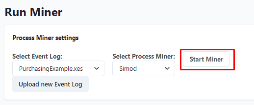

After sucessful finising you are notified by pop-up window. 
 

   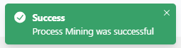

and as a result multiple files in .json and .bpmn format are produced. These files represent BPMN model and simulation parameters mined from event log. You can download each of them by clicking on it. 

To convert the output to the simulation scenario we choose simulation parameters file(.json configuration file) and BPMN model file. After clicking _Convert to Scenario_, we specify the scenario name. 

 

   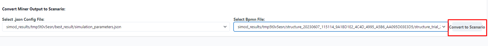

## Scenario Overview

On the Scenario Overview page, we can see the parameters of the scenario we created. These include general parameters, resource parameters and model-based parameters. To access this page, we need to click on _Scenario Overview_ on the navigation sidebar. If we want to change the general parameters or make a copy of the scenario with some modifications, we can click on _Edit_ and do so. 

 

   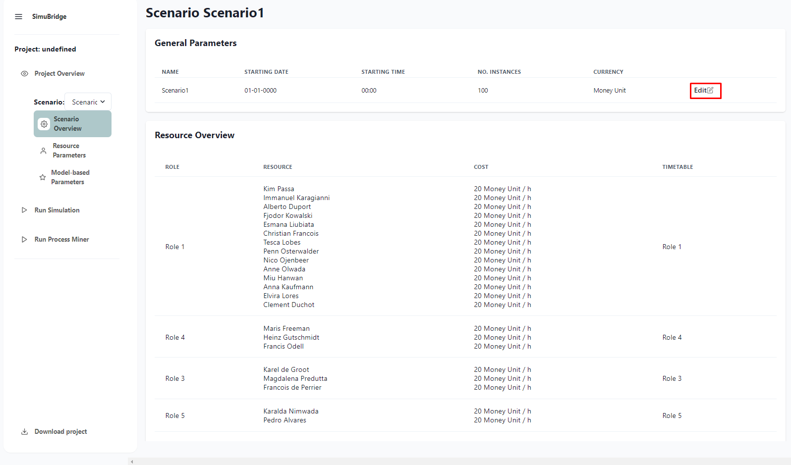

 
   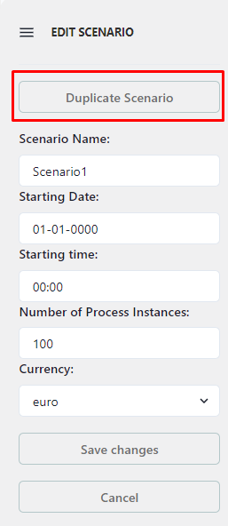

 
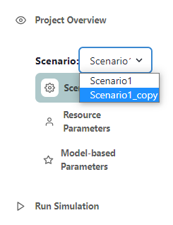

Let us duplicate the scenario and make some changes afterwards. 
After clicking _Duplicate Scenario_  Scenario1_copy is immediately created. But initial scenario is still dispayed. We can display newly created scenario by using a scenario switcher on the left sidebar. Let us just simpy choose Scenario1_copy. Now at 
_Scenario Overview_ page we can see Scenario1_copy. Let us make some changes: replace  scenario name Scenario1_copy with Scenario2 and change starting time to 12:00  by clicking  _Edit_ button. To save we click _Save Changes_.

 Let us now  explore other simulation scenario parameters: Resource Parameters and Model-based Parameters.

 
 
 
 

## Resource parameters

<!-- Screenshot for state after creating the data conditions -->

 Resource parameters provide an overview of involved in the business process resources and their schedule. To access resource parameters, we should click  _Resource Parameters_ on the sidebar navigation panel. 

Each resource is assigned to the specific role. Resources here are individual employees and roles could be considered as job positions.

 

   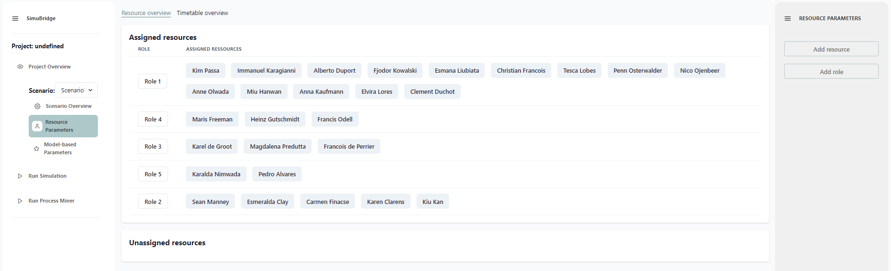

We can get detailed information about specific role or resource by clicking on it. 

 

   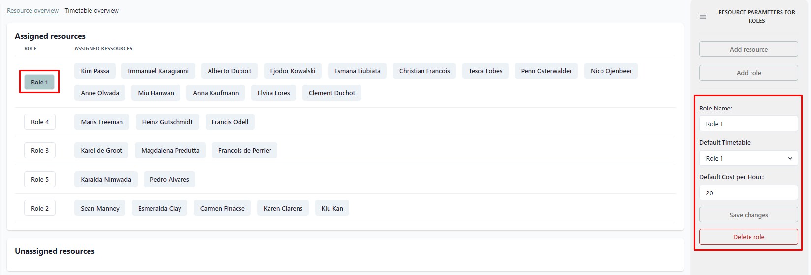

 

   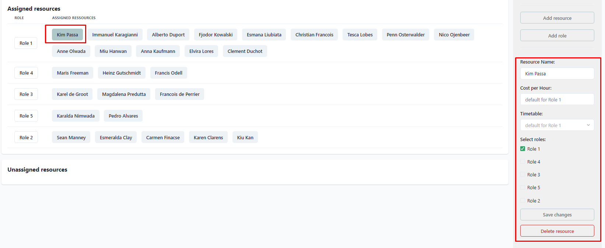

The resources that belong to a role inherit the same timetable and costs as the role. However, we can customize these parameters for each resource. To do this, we click on the resource we want to edit, enter the new values and click _Save Changes_.

   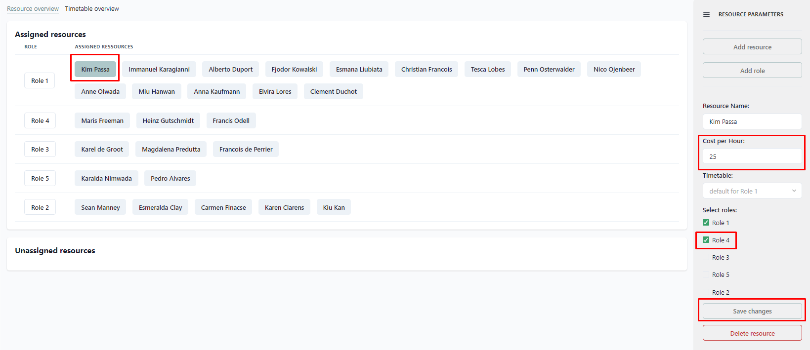

We can assign a resource to more than one role or leave it unassigned.To unassign a resource from a role, we just need to uncheck the checkboxes of the role(s) that the resource belongs to. If a resource has no role, it will show up in the unassigned resource section. 

   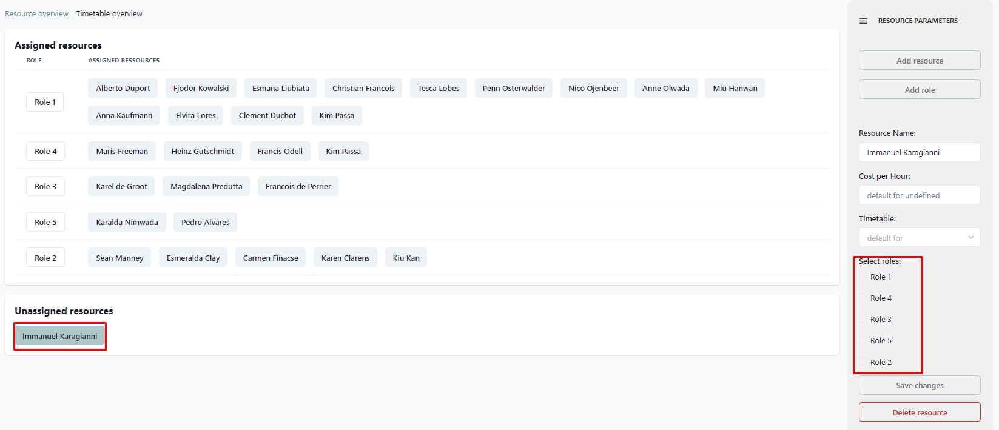

We can see the timetable of each role by clicking on the _Timetable_ tab on the tabbar.
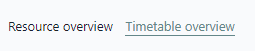
 
 
 

We can visualize the timetable by clicking on its name(usually is the same as the role name) and we can edit it by clicking on the day of the week and delete it or change the working hours.
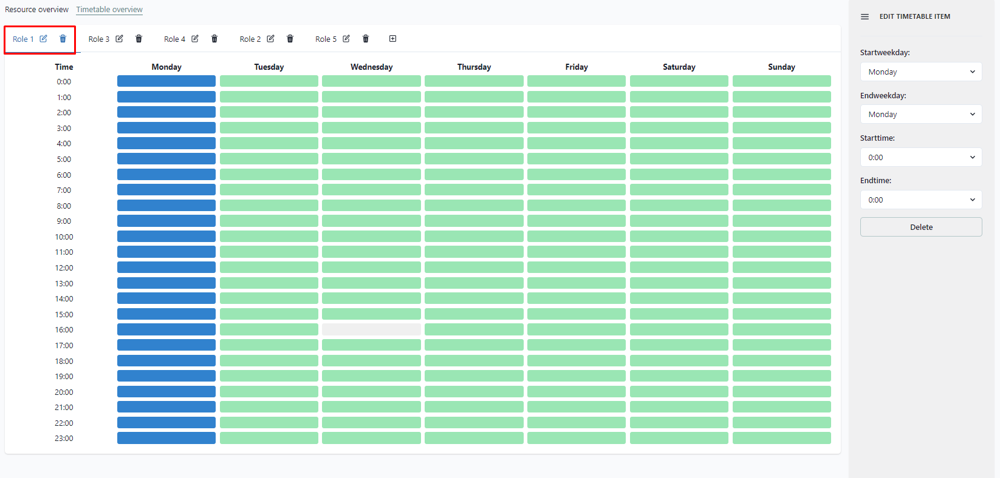   

We can add new timetable by clicking on "plus" sign.  
 
 
 
 

## Model-based parameters

To displayong the BPMN model of the business process we click on   _Modelbased Parameters_ on the navigation sidebar. We can zoom in or zoom out the model by clicking on the "plus" or "minus" at the bottom of the screen. Every element of BPMN model is clickable. After clicking, the sidebar with parameters of the chosen element will be displayed. It is possible to make changes. Let us add one more role to the first activity. To do this, expand the "Resources" section, press "plus" and select the name of the role. The changes will be saved automatically.

   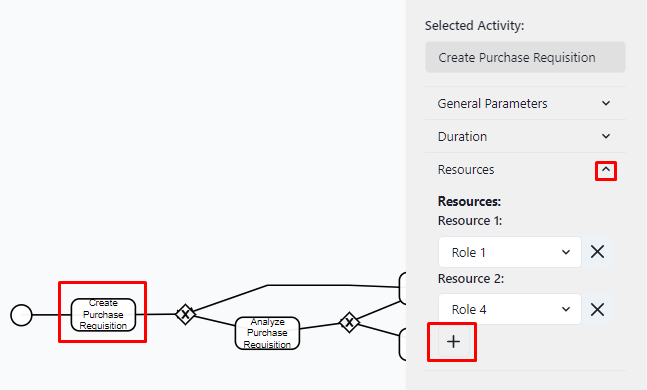

We can represent BPMN model as XML document or as a table for better overview, we can see all parameters in a table view. 
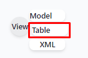 
For that click on _View_ on the bottom left of the screen and then click _Table_. We represent Activities, Gateways and Events in three separated sections. _Edit mode_ can be activated by clicking on it.
 
 
 
 

   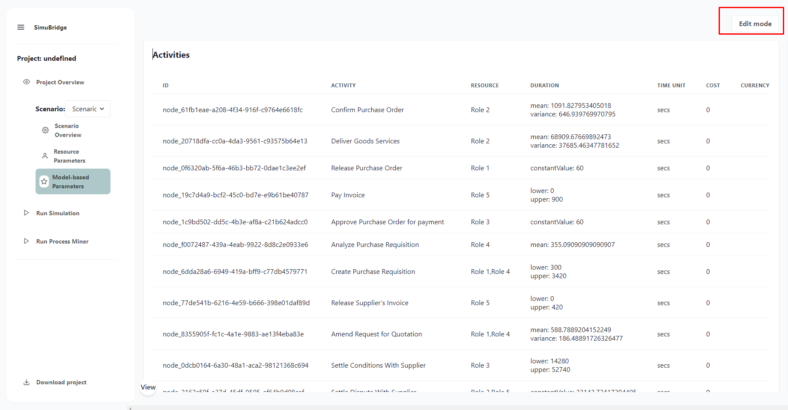

 
 

## Compare Scenarios
On the Project Overview page, we can see all the scenarios we have created. We can also duplicate, copy and delete scenarios from this page. If we want to see how different scenarios are, we can use the Compare Scenarios function.

To compare scenarios, we click on the _Compare scenarios_ button, select the scenarios we want to compare using the switches and click _Compare_.

The parameters of one scenario (current scenario, which is selected on the left sidebar). The parameters that are different in the other scenarios will be highlighted. The parameters that are the same in all scenarios will not be highlighted. We can click on a highlighted parameter to see its values in the other scenarios.

## Run Simulation

After specifying scenarios and reviewing all parameters we can run Simulation.The simulator requires a simulation scenario  as an input parameter. The user can choose it in a dropdown window. Additionally, the user has to choose a Simulation Tool from the available options. Currently, the only integrated simulation tool is Skylla.

## Additionally 
We can download project file in json format simply by clicking _Download Project_ on the sidebar navigation menu. The file will contain all created simulation scenarios and simulation parameters.

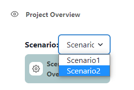
If you make changes to resource parameters or model parameters, the changes will only apply to the current scenario that you select in the left sidebar.
