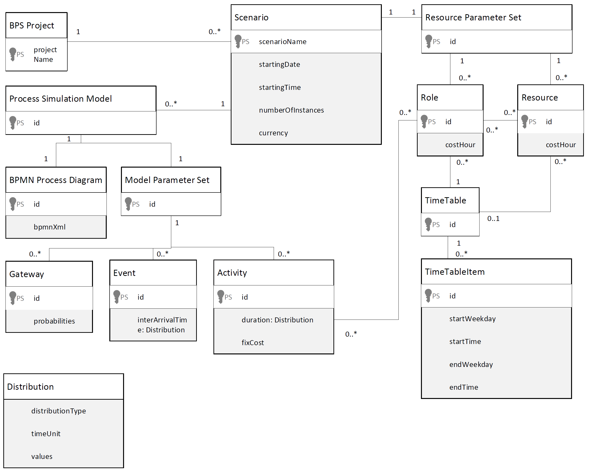

# SimuBridge <br> <sub> :star2: A Bridging Platform between Process Mining and Business Process Simulation :star2: <br><!-- TODO reconfigure CI  --></sub>


## :information_source: About


SimuBridge is a tool to parameterize and run business process simulations.
It bridges the gap between process mining systems, which discover simulation models from event logs, and business process simulators, which run the models. 
To do so, SimuBridge provides an interface to 
- execute process mining runs in external process mining tools
- import simulation models from the process mining results
- edit and manage simulation models and their parameters
- simulate these models in external simulation tools

It thus 
helps to integrate process mining and simulation tools
and reduces manual effort in the parameterization business process simulations.

## :technologist: Usage
For a usage manual, please refer to our [tutorial document](./.docs/tutorial/Tutorial.md) and to our [screencast](./TBD) <!-- TODO tutorial link  --> <!-- TODO maybe some half sentence on those two  -->

## :abcd: Repository Structure
This is the root repository for the SimuBridge project. It contains the main documentation, as well as the individual application components, which are distributed over Git submodules and GitHub subrepositories.
- [SimuBridge--Main/](../../../SimuBridge--Main/) is the main application repository for SimuBridge and contains the application source code.
- [Scylla-Container/](../../../Scylla-Container/) contains the sources for an http api and containerization of the business process simulator [Scylla](https://github.com/bptlab/scylla)
- [simod_http_augemented/](./simod_http_augemented/) includes the files needed for the integration of the process mining tool [Simod](https://github.com/AutomatedProcessImprovement/Simod)
- [example_data/](./example_data/) includes example data to test out the tool. Currently, this is limited to event logs that can be discovered and then simulated.

## :hammer_and_wrench: How to run it
To run SimuBridge, the main application as well as the process miner(s) and simulator(s) must be started.

### Option A: Using Docker-compose 
The easiest way to achieve this is to use docker and docker-compose. Currently, the containers need to built from scratch.

#### 1) Clone the repository
The first step to create the containers is to clone the repository
``` console
git clone --recurse-submodules git@github.com:INSM-TUM/SimuBridge.git
```
Note: In any case, make sure to include the `--recurse-submodules` flag so all submodules are properly loaded.

#### 2) Run Docker-compose
Navigate into the repository folder and run the following:
```console
docker-compose -f docker-compose.yml u
```

This will build and instantiate all three needed docker images. Congrats, you can now access SimuBridge in your browser at `localhost:3000`

Note: When running for the first time, the images have to actually be built, which takes some minutes. Please refere to the console outputs to track the build progress.


### Option B: From Scratch (recommended only for development)
Every of the three modules can also be run from scratch for development purposes. Please refer to the documentations of the individual submodules/folders for instructions how to run them.


## :information_source: Example Data
### Event Logs
We tested SimuBridge with various event logs from the research community. Under [example_data/event_logs](./example_data/event_logs), you can find some smaller logs that are cloned with the repository, namely the [Disco tutorial purchasing example](https://fluxicon.com/book/read/tutorial/) and the [Prom Tutorial repair example](https://promtools.org/prom-6-tutorial/introduction/#running_example).

Further, we tested the tools with a larger log (which is hence not part of the repository), namely the [BPI challenge 2012 log](https://data.4tu.nl/articles/dataset/BPI_Challenge_2012/12689204). Note that we translated the .gz file to .xes before applying process mining, and reduced the number of simulated process instances to 3000 due to performance limitations of the Scylla simulator. For testing SimuBridge, we recommend to first simulate at maximum 1000 instances.


## :microscope: Technical Reference
### Internal Data Model
In order to bridge between process mining and simulation tools, SimuBridge introduces a unified data format for simulation scenario to and from which it translates the outputs and inputs of the respective external tools.

This data model is cast into source code in the [simulation-bridge-datamodel](https://github.com/INSM-TUM/SimuBridge--Main/tree/main/dataModel) module found in the main application repository.

Further, we provide the following visualualization:

 <p align="center">
   
</p>

This data schema is implemented via the JSON format, i.e., as object trees, with BPSProject objects as roots.
"PS" in the diagram denotes unique ids for children in the respective tree-induced aggregation relations. For model parameters (gateways, events, activities), these ids correspond tp the respective model element ids of the BPMN XML.