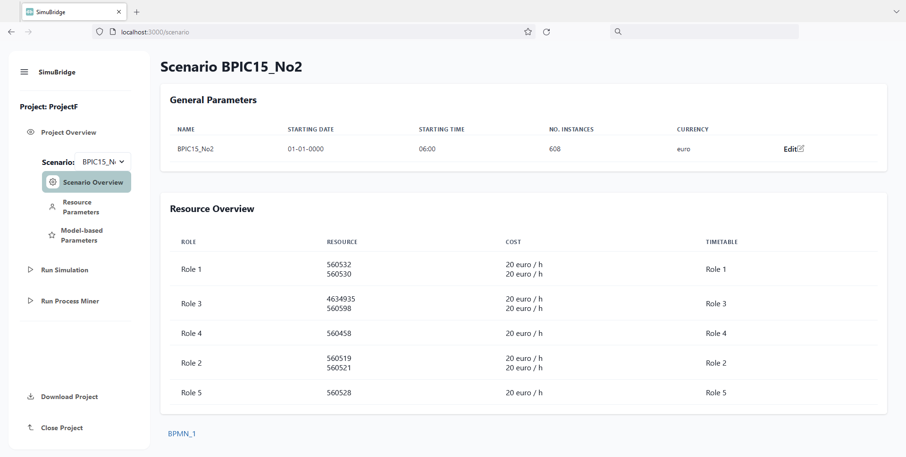

# SimuBridge <br> <sub> :star2: A Bridging Platform between Process Mining and Business Process Simulation :star2: <br></sub><!-- TODO reconfigure CI  -->


 <!-- TODO redo screenshot  -->

## :information_source: About


SimuBridge is a tool to parameterize and run business process simulations.
It bridges the gap between process mining systems, which discover simulation models from event logs, and business process simulators, which run the models. 
To do so, SimuBridge provides an interface to 
- execute process mining runs in external process mining tools
- import simulation models from the process mining results
- edit and manage simulation models and their parameters
- simulate these models in external simulation tools

It thus 
helps to integrate process mining and simulation tools
and reduces manual effort in the parameterization business process simulations.

## :technologist: Usage
For a usage manual, please refer to our [tutorial document](./.docs/tutorial/Tutorial.md) and to our [screencast](./TBD) <!-- TODO tutorial link  --> <!-- TODO maybe some half sentence on those two  -->

## :abcd: Repository Structure
This is the root repository for the SimuBridge project. It contains the main documentation, as well as the individual application components, which are distributed over Git submodules and GitHub subrepositories.
- [SimuBridge--Main/](./SimuBridge--Main/) is the main application repository for SimuBridge and contains the application source code.
- [Scylla-Container/](./Scylla-Container/) contains the sources for an http api and containerization of the business process simulator [Scylla](https://github.com/bptlab/scylla)
- [simod_http_augemented/](./simod_http_augemented/) includes the files needed for the integration of the process mining tool [Simod](https://github.com/AutomatedProcessImprovement/Simod)
- [example_data/](./example_data/) <!-- TODO put some explaination here  -->

## :hammer_and_wrench: How to run it
To run SimuBridge, the main application as well as the process miner(s) and simulator(s) must be started.

The easiest way to achieve this is to use docker and docker-compose. Currently, the containers need to built from scratch.

### Option A: Using Docker-compose 

#### 1) Clone the repository
The first step to create the containers is to clone the repository
``` console
git clone --recurse-submodules git@github.com:INSM-TUM/SimuBridge.git
```
Note: In any case, make sure to include the `--recurse-submodules` flag so all submodules are properly loaded.

#### 2) Run Docker-compose
Navigate into the repository folder and run the following:
```console
docker-compose -f docker-compose.yml u
```

This will build and instantiate all three needed docker images. Congrats, you can now access SimuBridge in your browser at `localhost:3000`

Note: When running for the first time, the images have to actually be built, which takes some minutes. Please refere to the console outputs to track the build progress.


### Option B: From Scratch (recommended only for development)
Every of the three modules can also be run from scratch for development purposes. Please refer to the documentations of the individual submodules/folders for instructions how to run them.
